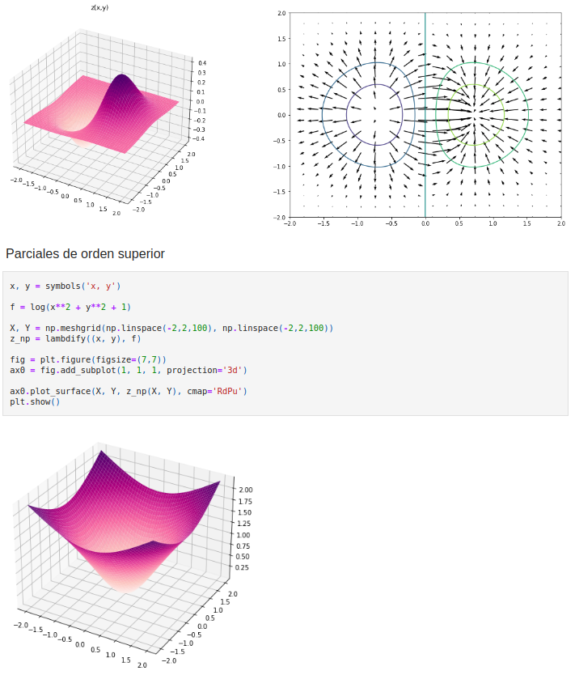

<iframe style="width: 100%; height: 500px; border: 1px solid rgba(0, 0, 0, 0.125);"
        src="https://archive.softwareheritage.org/browse/embed/swh:1:dir:57c9e9851d8ac4289c2dd9cfadbbf0160ae4c910;origin=https://github.com/rollervan/FunMat;visit=swh:1:snp:4cc3c4e3df9832e25d5039fa0364ffb8fa7eac79;anchor=swh:1:rev:1e226b41c35b6893907a97c5348787329654e6ec/">
</iframe>

# 
Repositorio de códigos de Fundamentos Matemáticos

       
### 
Máster Universitario en Visión Artificial

        

## Guía de uso 

Este repositorio consta de diferentes notebooks interactivos autocontenidos. Los diferentes ejercicios vienen explicados y detallados en los mismos.
Cada repositorio se puede descargar y ejecutar en local o directamente haciendo uso de Google Colab a través de los distintos enlaces.

## PARTE I - Estadística

* #### Tutorial Pytorch:

* #### Tutorial Pytorch (alumnos):

## PARTE II - Álgebra y Cálculo Variacional

* #### Clase I:

* #### Clase II: 

* #### Clase III: 

* #### Clase IV: 

* #### Clase V: 

* #### Clase VI: 

* #### Clase VII: 

## PARTE III - Aprendizaje Automático y Profundo

* #### Práctica Denoising TV: 

* #### Práctica Adversarial Examples (Pytorch):

* #### Práctica Adversarial Examples (TensorFlow):

* #### Convolución como producto matricial: 

* #### Ejemplo función XOR con y sin activación no lineal:

* #### Tutorial Pytorch:

* #### Tutorial Pytorch (alumnos):

## Licencias
Este código está bajo licencia Apache License 2.0.